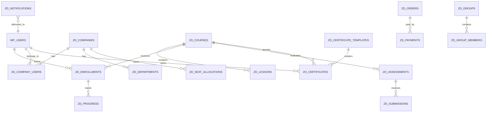

# Zadora LMS Database Architecture

## ERD

## Tables

All tables use the active WordPress table prefix.

### `zadora_courses`

Dedicated course records optimized for LMS querying.

- `id` BIGINT unsigned primary key.
- `author_id` BIGINT unsigned, references `wp_users.ID`.
- `company_id` BIGINT unsigned nullable for future tenant ownership.
- `title` VARCHAR(190).
- `slug` VARCHAR(190) unique.
- `summary` TEXT nullable.
- `description` LONGTEXT nullable.
- `status` VARCHAR(40): `draft`, `coming_soon`, `open`, `private`, `closed`, `archived`.
- `visibility` VARCHAR(40): `public`, `private`, `company`, `group`.
- `price_amount` DECIMAL(12,2) nullable.
- `currency` CHAR(3) nullable.
- `certificate_template_id` BIGINT unsigned nullable.
- `created_at`, `updated_at` DATETIME.

Indexes: `slug`, `status`, `visibility`, `company_id`, `author_id`.

### `zadora_lessons`

- `id`, `course_id`, `title`, `slug`, `content`, `sort_order`, `duration_minutes`, `is_preview`, timestamps.

Indexes: `(course_id, sort_order)`, `slug`.

### `zadora_enrollments`

- `id`, `course_id`, `user_id`, `company_id`, `status`, `source`, `started_at`, `completed_at`, timestamps.

Unique: `(course_id, user_id)`.

Indexes: `user_id`, `company_id`, `status`, `completed_at`.

### `zadora_progress`

- `id`, `enrollment_id`, `lesson_id`, `status`, `progress_percent`, `completed_at`, timestamps.

Unique: `(enrollment_id, lesson_id)`.

### `zadora_assessments`

- `id`, `course_id`, `title`, `type`, `settings_json`, `passing_score`, timestamps.

### `zadora_submissions`

- `id`, `assessment_id`, `user_id`, `status`, `score`, `answers_json`, `feedback`, `graded_by`, `graded_at`, timestamps.

Indexes: `assessment_id`, `user_id`, `status`.

### `zadora_certificate_templates`

- `id`, `owner_id`, `company_id`, `name`, `layout_json`, `background_asset_id`, `is_default`, timestamps.

Indexes: `owner_id`, `company_id`, `is_default`.

### `zadora_certificates`

- `id`, `certificate_number`, `verification_hash`, `user_id`, `course_id`, `template_id`, `display_name`, `snapshot_json`, `pdf_url`, `issued_at`, `expires_at`, `revoked_at`, timestamps.

Unique: `certificate_number`, `verification_hash`.

Indexes: `user_id`, `course_id`, `expires_at`, `issued_at`.

### `zadora_companies`

- `id`, `name`, `slug`, `logo_url`, `status`, `primary_admin_id`, `seat_limit`, timestamps.

Unique: `slug`.

### `zadora_company_users`

- `id`, `company_id`, `user_id`, `department_id`, `role`, `status`, timestamps.

Unique: `(company_id, user_id)`.

### `zadora_departments`

- `id`, `company_id`, `name`, `parent_id`, timestamps.

Indexes: `company_id`, `parent_id`.

### `zadora_groups`

- `id`, `company_id`, `name`, `description`, timestamps.

### `zadora_group_members`

- `id`, `group_id`, `user_id`, `role`, timestamps.

Unique: `(group_id, user_id)`.

### `zadora_notifications`

- `id`, `user_id`, `type`, `title`, `body`, `data_json`, `read_at`, `created_at`.

Indexes: `(user_id, read_at)`, `type`, `created_at`.

### `zadora_announcements`

- `id`, `scope_type`, `scope_id`, `author_id`, `title`, `body`, `starts_at`, `ends_at`, timestamps.

Indexes: `(scope_type, scope_id)`, `starts_at`, `ends_at`.

### `zadora_orders`

- `id`, `user_id`, `course_id`, `company_id`, `status`, `amount`, `currency`, `gateway`, `gateway_reference`, timestamps.

Unique: `gateway_reference`.

### `zadora_payments`

- `id`, `order_id`, `gateway`, `gateway_reference`, `status`, `amount`, `currency`, `payload_json`, `paid_at`, timestamps.

Unique: `gateway_reference`.

### `zadora_ai_requests`

- `id`, `user_id`, `company_id`, `provider`, `task`, `status`, `input_hash`, `tokens_in`, `tokens_out`, `cost_minor`, `result_json`, timestamps.

Indexes: `user_id`, `company_id`, `provider`, `task`, `status`.

## Data Validation Strategy

- Controllers sanitize transport input.
- Command objects validate required fields, enum values, ownership, and numeric ranges.
- Services enforce business invariants.
- Repositories perform final persistence shaping.
- Database constraints protect uniqueness and query integrity.
- JSON columns are validated against module-owned schemas before persistence.

## Foreign Keys

MySQL foreign keys are used where safe for Zadora-owned tables. References to WordPress users are indexed but not hard-constrained by default because WordPress installs vary and user deletion behavior is plugin-mediated.
